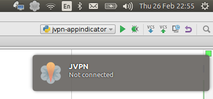
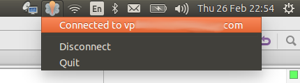

# jvpn-appindicator
Appindicator to use jvpn (Junos Pulse VPN) by more comfortable way. 

# Screenshots





# Feartures
* Security save your credentials in your . 
* Java free =) 

## Requirements

You'll need at least the following components:

1. Python 2.x (tested with 2.7)
2. 

# Instalithion
1. Clone this repository into a fresh directory
2. Install , configure and test it. You must not save username/password in _jvpn.ini_ but set suid bit on the "ncsvc" binary to run it without sudo.
3. Just launch ```jvpn-appindicator.py``` if you`ve installed _jvpn_ in _/opt/jvpn/_ or pass jvpn folder as argument to script if you prefer another location
4. Add app to startup application by using ```gnome-session-properties``` for example